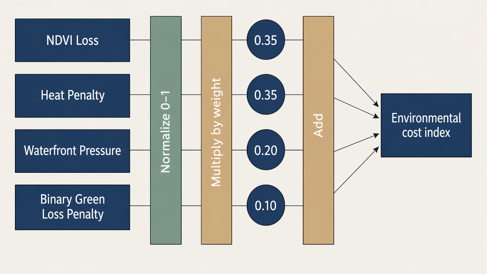

```{python}
#| echo: false

import pandas as pd
import plotly.express as px
import plotly.io as pio
from IPython.display import HTML, display

pio.renderers.default = "notebook_connected"
```

## Where has London grown, and what environmental cost came with that growth?

This interactive application examines not only where urban growth has occurred in London, but also what environmental cost has accompanied that growth.

Urban expansion is often mapped in terms of new built-up land, but this alone does not reveal what has been lost or whether some areas experience disproportionately higher environmental impact. This project addresses that gap by focusing on the uneven environmental consequences of urban growth.

It therefore asks a key analytical and decision-oriented question: why does urban growth generate uneven environmental cost across London, and where might intervention be most needed?

To address this, the application combines spatial analysis with borough-level indicators to examine not only where high-cost growth occurs, but also how underlying land transformation processes contribute to these patterns.

[Open the interactive application](https://extreme-flame-493900-h7.projects.earthengine.app/view/london-growth-cost-explorer)

[View the source code on GitHub](https://github.com/LuHaot1an/CASA0025_Project_Vme50)


::: {.callout-tip appearance="simple"}
## Start exploring

- Use the interactive map to explore spatial patterns of urban growth and environmental cost.
- Compare boroughs with the highest environmental cost using the ranking chart.
- Examine the land-replacement chart to understand what types of environments are being lost.
:::

## Project Summary

### Problem Statement

Urban expansion maps typically show where development has occurred, but fail to explain what has been lost and where intervention is most needed.

This application addresses a decision-oriented question: **where should planners prioritise intervention to mitigate the environmental cost of recent urban growth in London?**

By linking land conversion processes with environmental indicators including green loss, heat penalty, NDVI reduction, and water-edge pressure, the application enables users to diagnose not only where growth has occurred, but why certain areas exhibit higher environmental cost.

### End User

The primary users are borough-level planning officers and environmental analysts responsible for evaluating development pressure and prioritising mitigation strategies.

The application also supports policy teams and community stakeholders by providing accessible spatial evidence on where urban growth has produced disproportionate environmental costs.

### Data

This project integrates multiple Earth Engine datasets to capture different dimensions of environmental change associated with urban growth.

Dynamic World provides land cover classification data, enabling identification of land cover types and their changes over time.

Sentinel-2 imagery represents vegetation condition through NDVI, allowing assessment of changes in green cover.

Landsat 8/9 provides land surface temperature data, capturing thermal conditions associated with urban expansion.

JRC Global Surface Water represents stable water bodies and water-adjacent environments, supporting analysis of development pressure near sensitive areas.

London borough boundaries provide the spatial framework for aggregating results and enabling comparison across the city.


### Methodology

Urban growth was identified by detecting transitions to built-up land using Dynamic World classifications, with analysis restricted to newly developed areas to isolate recent expansion processes. This approach is consistent with research showing that urban expansion is a major driver of land-use change and environmental transformation (Seto et al., 2012).

Environmental impacts were then calculated specifically for these new built-up pixels, reflecting the understanding that the consequences of urbanisation depend not only on the extent of development but also on the type of land being transformed (Foley et al., 2005).

Green loss was derived from vegetation-to-built transitions, in line with studies highlighting the importance of urban green infrastructure for environmental quality and ecological resilience (Wolch et al., 2014; Haase et al., 2014). Heat penalty was estimated from differences in land surface temperature, capturing the urban heat island effect associated with built-up expansion (Oke, 1982; Zhou et al., 2014).

These indicators were combined into a composite environmental cost index and aggregated at the borough level to support spatial comparison across London. This aggregation enables the identification of broader spatial patterns while maintaining interpretability for non-expert users.

However, the analysis may be influenced by classification uncertainty and the spatial resolution of remote sensing data, which can affect the detection of fine-scale land transitions. In addition, the environmental cost index simplifies complex ecological processes into a limited set of indicators, and therefore may not fully capture all dimensions of environmental impact.

The use of cloud-based geospatial platforms such as Google Earth Engine enables this large-scale analysis by integrating multiple datasets and performing computation at scale.

### Interface

The interface combines an interactive map, control panel, and summary outputs to support a clear analytical workflow. Users can switch between layers showing new built-up areas, land replacement types, NDVI loss, heat penalty, and composite growth cost.

They can select a borough from a dropdown menu or click directly on the map to view local summaries. Supporting charts on the project webpage provide borough-level comparison, allowing users to move from spatial exploration in the map to broader analytical interpretation.

## How to Use This Application

Start with the interactive map to explore where urban growth has taken place and how environmental cost varies across London.

Then use the borough ranking chart to identify which areas show the highest relative environmental cost. The land-replacement chart helps explain what types of land are being converted into built-up surfaces, while the borough-versus-London chart shows whether selected boroughs sit above or below the city-wide average across key indicators.

Together, these components help users move from spatial observation to borough-level comparison and comparative interpretation.

## Interactive Map

Explore spatial patterns of urban growth and environmental cost across London.

Use the layer controls to switch between indicators such as newly built-up land, vegetation loss, heat exposure, and composite growth cost. Click a borough to inspect its local patterns.

Note: The map is hosted via Google Earth Engine and may take a few seconds to load depending on network conditions.

If the map does not load, [click here to open the interactive map](https://extreme-flame-493900-h7.projects.earthengine.app/view/london-growth-cost-explorer).

<iframe
  src="https://extreme-flame-493900-h7.projects.earthengine.app/view/london-growth-cost-explorer"
  width="100%"
  height="760"
  style="border:1px solid #d9d9d9; border-radius:10px;"
></iframe>


## How the Cost Index is Calculated

The environmental growth cost index combines multiple indicators derived from Google Earth Engine:

* vegetation loss and NDVI decline
* heat exposure associated with new built-up land
* pressure on water-adjacent land
* land-cover transitions into built surfaces

Each indicator is normalised and aggregated to produce a composite score at borough level. This allows comparison across boroughs while capturing multiple dimensions of environmental impact.

::: {style="text-align: center;"}

:::

This index is intended as a comparative diagnostic measure rather than a precise absolute measure of environmental damage.

The charts below reflect the same borough-level outputs used in the interactive application and help summarise the main patterns visible in the map.

## How it Works

The application is built in Google Earth Engine (GEE) and combines pre-processed environmental indicators with an interactive user interface.

Urban growth is first identified through land cover change detection, and newly built-up areas are used to derive a set of environmental indicators, including vegetation loss, NDVI decline, heat penalty, and water-edge pressure. These indicators are then normalised and aggregated at borough level to produce a composite growth cost index. The equal-weighted index is intended to support relative comparison across boroughs rather than provide an absolute measure of environmental damage.

The processed outputs are stored as GEE assets and loaded into the application as image layers and borough-level summary tables. The interface allows users to switch between indicators, select boroughs, and inspect summary statistics and charts.

```js
var growthCostImg = ee.Image(ASSETS.growthCost);
mainMap.addLayer(growthCostImg, {min: 0, max: 1}, 'Growth Cost Index');
````

User interaction is handled through the GEE UI framework. Boroughs can be selected either from a dropdown menu or by clicking directly on the map. Once a borough is selected, the application retrieves precomputed values from a cached borough dataset and updates the summary card, ranking context, and borough-level charts without repeating heavy server-side computation.

```js
function activateBorough(gssCode, zoomToIt) {
  var row = CACHE.boroughsByCode[gssCode];
  renderBoroughSummaryCard(row);
  renderBoroughCharts(row);
  renderMap();
}
```

The chart module then provides three linked outputs: a London-wide ranking chart, a standardised borough indicator chart, and a borough-versus-London comparison chart. Together, these components enable users to move from spatial exploration to borough-level interpretation of environmental cost.


## Which Boroughs Show the Highest Cost?

Hover over each bar to inspect exact borough-level values.

Higher values indicate disproportionately higher environmental cost associated with urban growth, helping identify priority areas for potential intervention. These rankings support comparison of relative environmental cost across boroughs rather than absolute levels of development.

```{python}
#| echo: false
#| warning: false
#| message: false

df_rank = pd.read_csv("data/vme50_london_growth_D_borough_ranking_clean.csv")

top10 = (
    df_rank[["NAME", "d_mean_growth_cost_index"]]
    .dropna()
    .sort_values("d_mean_growth_cost_index", ascending=False)
    .head(10)
    .sort_values("d_mean_growth_cost_index", ascending=True)
)

fig1 = px.bar(
    top10,
    x="d_mean_growth_cost_index",
    y="NAME",
    orientation="h",
    color="d_mean_growth_cost_index",
    color_continuous_scale="Blues",
    labels={
        "d_mean_growth_cost_index": "Mean Growth Cost Index",
        "NAME": ""
    },
    title="Top 10 Boroughs by Growth Cost Index (higher = greater environmental cost)"
)

fig1.update_layout(
    height=620,
    coloraxis_showscale=False,
    margin=dict(l=20, r=20, t=70, b=20),
    paper_bgcolor="white",
    plot_bgcolor="white"
)

fig1.update_traces(
    hovertemplate="<b>%{y}</b><br>Growth cost index: %{x:.3f}<extra></extra>"
)

fig1.show(config={
    "displaylogo": False,
    "modeBarButtonsToRemove": [
        "zoom2d", "pan2d", "select2d", "lasso2d",
        "zoomIn2d", "zoomOut2d", "autoScale2d",
        "resetScale2d", "toggleSpikelines"
    ]
})
```

### Growth Cost Index across London

This map shows the spatial distribution of the Growth Cost Index across London boroughs.

Higher values indicate areas where recent urban expansion is associated with greater environmental cost.

The pattern suggests that environmental impacts are unevenly distributed across the city.

::: {.callout-note appearance="simple"}
**Key Insight**

Environmental costs of urban growth are not evenly distributed across London, suggesting spatially uneven trade-offs between development and environmental impact.

Some boroughs experience significantly higher trade-offs between development and ecological impact, suggesting that a one-size-fits-all planning approach may be insufficient.

Targeted interventions may be required in high-cost areas to better balance growth and environmental sustainability.
:::

## What Did New Development Replace?

This chart shows which types of land are most frequently replaced by new built-up areas, highlighting the environmental trade-offs associated with urban expansion.

It complements the ranking chart by showing what kinds of environments are being lost in boroughs with the largest transition into built-up land. This helps explain how different types of land conversion directly contribute to uneven environmental cost patterns.

Hover over each segment to compare which land types were most frequently replaced in the boroughs with the largest total transition into built-up land.

```{python}
#| echo: false
#| warning: false
#| message: false

df_trans = pd.read_csv("data/borough_transition_test.csv")

df_trans["total"] = (
    df_trans["grass_to_built_km2"] +
    df_trans["trees_to_built_km2"] +
    df_trans["water_to_built_km2"] +
    df_trans["shrub_to_built_km2"] +
    df_trans["crops_to_built_km2"]
)

top_boroughs = df_trans.sort_values("total", ascending=False).head(8).copy()

long_df = top_boroughs.melt(
    id_vars="NAME",
    value_vars=[
        "grass_to_built_km2",
        "trees_to_built_km2",
        "shrub_to_built_km2",
        "crops_to_built_km2",
        "water_to_built_km2"
    ],
    var_name="Land Type",
    value_name="Area"
)

mapping = {
    "grass_to_built_km2": "Grass",
    "trees_to_built_km2": "Trees",
    "shrub_to_built_km2": "Shrub",
    "crops_to_built_km2": "Crops",
    "water_to_built_km2": "Water"
}

long_df["Land Type"] = long_df["Land Type"].map(mapping)

borough_order = top_boroughs.sort_values("total", ascending=True)["NAME"].tolist()

fig2 = px.bar(
    long_df,
    y="NAME",
    x="Area",
    color="Land Type",
    orientation="h",
    title="Land Types Replaced by New Built-up Areas",
    labels={
        "NAME": "",
        "Area": "Area replaced by new built-up land (km²)"
    },
    color_discrete_map={
        "Grass": "#7fc97f",
        "Trees": "#1b9e77",
        "Shrub": "#66c2a5",
        "Crops": "#ffd92f",
        "Water": "#80b1d3"
    },
    category_orders={
        "NAME": borough_order,
        "Land Type": ["Grass", "Trees", "Shrub", "Crops", "Water"]
    }
)

fig2.update_layout(
    height=620,
    margin=dict(l=20, r=20, t=70, b=20),
    barmode="stack",
    paper_bgcolor="white",
    plot_bgcolor="white"
)

fig2.update_traces(
    hovertemplate="<b>%{y}</b><br>%{fullData.name}: %{x:.4f} km²<extra></extra>"
)

fig2.show(config={
    "displaylogo": False,
    "modeBarButtonsToRemove": [
        "zoom2d", "pan2d", "select2d", "lasso2d",
        "zoomIn2d", "zoomOut2d", "autoScale2d",
        "resetScale2d", "toggleSpikelines"
    ]
})
```

### Indicator Breakdown

This chart compares the contribution of different indicators to the overall growth cost across boroughs.

While some areas are primarily affected by green loss, others show stronger heat penalties or water-edge pressure.

This indicates that environmental impacts of urban growth vary in structure, not just in magnitude.

## How Do Boroughs Compare to the London Average?

This chart compares borough-level values with the London average across key environmental indicators.

Values above the average indicate relatively higher environmental cost. It helps show whether high-cost boroughs are consistently above average or driven by particular dimensions such as green loss or heat exposure.

```{python}
#| echo: false
#| warning: false
#| message: false

df_rank = pd.read_csv("data/vme50_london_growth_D_borough_ranking_clean.csv")

selected_borough = (
    df_rank[["NAME", "d_mean_growth_cost_index"]]
    .dropna()
    .sort_values("d_mean_growth_cost_index", ascending=False)
    .iloc[2]["NAME"]
)

indicators = {
    "Growth Cost": "d_mean_growth_cost_index",
    "Green-loss share": "d_green_loss_share_of_new_built",
    "Water-edge share": "d_water_edge_share_of_new_built",
    "NDVI loss": "d_mean_ndvi_loss",
    "Heat penalty": "d_mean_heat_penalty_k"
}

row = df_rank.loc[df_rank["NAME"] == selected_borough].copy()

if row.empty:
    fallback = (
        df_rank[["NAME", "d_mean_growth_cost_index"]]
        .dropna()
        .sort_values("d_mean_growth_cost_index", ascending=False)
        .iloc[0]["NAME"]
    )
    selected_borough = fallback
    row = df_rank.loc[df_rank["NAME"] == selected_borough].copy()

london_avg = {
    label: df_rank[col].mean()
    for label, col in indicators.items()
}

borough_vals = {
    label: float(row.iloc[0][col])
    for label, col in indicators.items()
}

plot_df = pd.DataFrame({
    "Metric": list(indicators.keys()) * 2,
    "Value": list(borough_vals.values()) + list(london_avg.values()),
    "Group": [selected_borough] * len(indicators) + ["London average"] * len(indicators)
})

fig3 = px.bar(
    plot_df,
    x="Metric",
    y="Value",
    color="Group",
    barmode="group",
    title=f"{selected_borough} vs London average",
    labels={
        "Metric": "",
        "Value": "Indicator value"
    },
    color_discrete_map={
        selected_borough: "#a50f15",
        "London average": "#9ca3af"
    }
)

fig3.update_layout(
    height=560,
    margin=dict(l=20, r=20, t=70, b=20),
    paper_bgcolor="white",
    plot_bgcolor="white",
    legend_title_text=""
)

fig3.update_traces(
    hovertemplate="<b>%{x}</b><br>%{fullData.name}: %{y:.3f}<extra></extra>"
)

fig3.show(config={
    "displaylogo": False,
    "modeBarButtonsToRemove": [
        "zoom2d", "pan2d", "select2d", "lasso2d",
        "zoomIn2d", "zoomOut2d", "autoScale2d",
        "resetScale2d", "toggleSpikelines"
    ]
})
```

### Land Cover Transitions

This figure illustrates land cover transitions associated with new development.

A large proportion of new built-up land replaces vegetated surfaces, indicating a direct link between urban expansion and green space loss.

This reinforces the interpretation that recent growth is closely tied to ecological transformation.

## What the Results Suggest

Together, the three analytical components provide a connected interpretation of environmental cost. The ranking identifies where growth is most costly, the land-replacement analysis explains what types of land contribute to this cost, and the borough comparison reveals whether these patterns are consistent across multiple environmental dimensions.

Environmental cost is not evenly distributed across London, reflecting broader findings that the impacts of urban expansion are spatially uneven and shaped by local land-use context (Seto et al., 2012). This uneven distribution may also reflect patterns of environmental inequality observed in urban systems, where some areas experience disproportionate environmental burdens (Boone et al., 2009).

The ranking results show that several outer boroughs consistently exhibit higher growth cost values. The land-replacement analysis suggests that this pattern is closely linked to the conversion of green and ecologically sensitive land into built-up areas, reinforcing evidence that urban expansion often occurs at the expense of green infrastructure (Wolch et al., 2014). This transformation may also imply a reduction in ecosystem services that are important for maintaining urban environmental quality (Haase et al., 2014).

Further comparison with the London average indicates that these boroughs often exceed city-wide values across multiple indicators, including vegetation loss and heat exposure. This suggests that high environmental cost reflects a combination of interacting pressures associated with urban expansion, highlighting the complexity of urban systems (Batty, 2013). Increased heat exposure, for example, is consistent with the urban heat island effect identified in both foundational and recent studies (Oke, 1982; Zhou et al., 2014).

These findings highlight the need for more spatially targeted planning approaches to better balance urban development and environmental sustainability. However, these patterns should be interpreted with caution, as they represent spatial associations rather than direct causal relationships, and may be influenced by underlying data limitations.

### Why This Matters

Urban growth is often assessed by how much land is developed, but this alone does not capture its environmental consequences.

By linking new development to green loss, heat increase, and pressure on sensitive areas, this application reveals where urban expansion is likely to impose higher ecological costs.

These costs are unevenly distributed across London, indicating that some boroughs experience more intensive environmental trade-offs than others.

This provides evidence to support more targeted planning decisions, helping identify where mitigation, protection, or further investigation may be most needed.

## Behind the Application

This application is designed for planners, local authorities, and environmental teams who need accessible and interpretable spatial evidence on where recent urban growth may be associated with higher environmental cost.

It integrates Google Earth Engine datasets, including land-cover transitions, NDVI, land surface temperature, and water-related indicators, to enable borough-level comparison.

The design prioritises simplicity and interpretability, allowing users to quickly identify high-cost growth areas and explore underlying environmental patterns without requiring specialist GIS expertise.

## Team Contributions

### Preprocessing

* **A**: Data acquisition and standardisation, including integrating multi-source datasets (Dynamic World, Sentinel-2, Landsat, JRC Water) and defining a consistent study extent and temporal framework for London

* **B**: Image preprocessing and preparation, including cloud removal, temporal filtering, and ensuring spatial and temporal consistency across datasets for analysis readiness

---

### Analysis

* **C**: Land-use change detection and built-up area identification, including deriving land transition patterns and quantifying what types of land were replaced by urban growth

* **D**: Environmental indicator construction, including calculating NDVI loss, heat penalty, and water-edge encroachment, and developing the composite Growth Cost Index and borough-level aggregation

---

### Visualisation

* **E**: GEE interface design and interaction development, including map layer control, borough selection, and interactive querying to support exploratory analysis

* **F**: Chart development and front-end integration, including linking borough-level data to interactive charts, embedding visual outputs into the Quarto interface, and ensuring coordinated interaction between charts and the Earth Engine application

## Limitations

This analysis relies on satellite-derived indicators, which may not fully capture fine-scale or short-term urban changes. Uncertainty may arise from land-cover classification accuracy, temporal resolution, and the aggregation of multiple indicators into a composite index, all of which can influence the detection of land transitions.

The growth cost index is based on equal weighting of indicators, providing a transparent and consistent baseline. However, this assumption may not reflect the relative importance of different environmental processes, and alternative weighting schemes could lead to different borough rankings.

In addition, borough-level aggregation may mask local variation within boroughs, meaning that intra-borough differences are not explicitly represented. As a result, areas of high environmental cost may be generalised at the borough scale, potentially obscuring more localised patterns.

Furthermore, the analysis identifies spatial associations rather than causal relationships, and observed patterns may also be influenced by unobserved socio-environmental factors.

The index should therefore be interpreted as a comparative diagnostic tool rather than an absolute measure of environmental impact. Future work could explore sensitivity to indicator selection, weighting schemes, and spatial scale to better understand how different dimensions contribute to overall environmental cost.

## References

Seto, K. C., Güneralp, B., & Hutyra, L. R. (2012). Global forecasts of urban expansion to 2030 and direct impacts on biodiversity and carbon pools. *Proceedings of the National Academy of Sciences*, 109(40), 16083–16088.

Foley, J. A. et al. (2005). Global consequences of land use. *Science*, 309(5734), 570–574.

Wolch, J. R., Byrne, J., & Newell, J. P. (2014). Urban green space, public health, and environmental justice. *Landscape and Urban Planning*, 125, 234–244.

Haase, D. et al. (2014). A quantitative review of urban ecosystem service assessments: concepts, models, and implementation. *Ambio*, 43(4), 413–433.

Oke, T. R. (1982). The energetic basis of the urban heat island. *Quarterly Journal of the Royal Meteorological Society*, 108(455), 1–24.

Zhou, D., Xiao, J., Bonafoni, S., et al. (2014). Satellite remote sensing of surface urban heat islands: Progress, challenges, and perspectives. *Remote Sensing*, 6(11), 11993–12016.

Boone, C. G., Buckley, G. L., Grove, J. M., & Sister, C. (2009). Parks and people: An environmental justice inquiry in Baltimore, Maryland. *Annals of the Association of American Geographers*, 99(4), 767–787.

Batty, M. (2013). *The New Science of Cities*. MIT Press.
